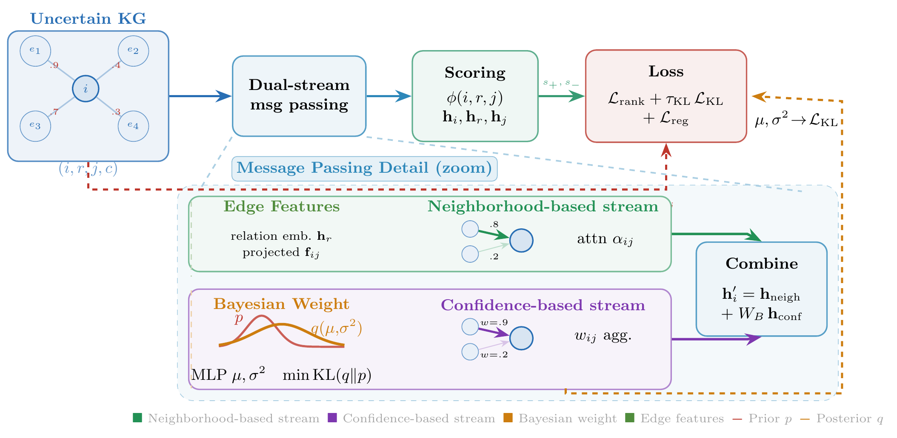

# DS-GAT



DS-GAT is a dual-stream graph attention network for uncertain knowledge graph embedding. It is evaluated against two groups of baselines:

- **unKR baselines** (BEUrRE, GTransE, PASSLEAF, UKGElogi, UKGErect, UKGsE, UPGAT, GMUC): published results from the [unKR benchmark](https://github.com/seucoin/unKR/), covering confidence prediction and link prediction on CN15k, NL27k, and PPI5k.
- **GAT baselines** (EGAT, WSGAT, GATv2): re-implemented graph attention models trained under the same conditions as DS-GAT, providing a direct comparison on identical data splits and evaluation protocol.

All experiments are run on three uncertain knowledge graph datasets: **CN15k**, **NL27k**, and **PPI5k**.

Hyperparameters for every model and dataset are stored in YAML config files:
- `config/` — DS-GAT main model (DSGAT2) and ablations (DSGATA1, DSGATA2)
- `config/GAT/` — GAT baseline models (EGAT, WSGAT, GATV2)
- `baselinesUNKR/config/` — unKGE baseline models (PASSLEAF, UPGAT), organized by dataset

---

## Setup

```bash
# 1. PyTorch with CUDA (example: CUDA 11.8)
pip install torch torchvision --index-url https://download.pytorch.org/whl/cu118

# 2. PyTorch Geometric
pip install torch-geometric

# 3. torch-scatter (must match torch + CUDA version)
TORCH_VER=$(python -c "import torch; print(torch.__version__)")
pip install torch-scatter -f "https://data.pyg.org/whl/torch-${TORCH_VER}+cu118.html"

# 4. Remaining dependencies
pip install -r requirements.txt
```

---

## Running DS-GAT

The recommended way to run experiments is via a YAML config file. All configs are in `config/`.

### Main model (DSGAT2)

```bash
python models.py --config config/DSGAT2_cn15k.yaml
python models.py --config config/DSGAT2_nl27k.yaml
python models.py --config config/DSGAT2_ppi5k.yaml
```

Any config value can be overridden on the command line — CLI arguments always take precedence over the YAML file:

```bash
# Use the cn15k config but run on GPU 1 and change dropout
python models.py --config config/DSGAT2_cn15k.yaml --gpu 1 --dropout 0.3
```

### Ablation models (DSGATA1, DSGATA2)

```bash
python models.py --config config/ablation/DSGATA1_cn15k.yaml
python models.py --config config/ablation/DSGATA2_nl27k.yaml
```

### GAT baseline models (EGAT, WSGAT, GATV2)

Config files are in `config/GAT/`:

```bash
# Single model
python models.py --config config/GAT/EGAT_cn15k.yaml
python models.py --config config/GAT/WSGAT_nl27k.yaml
python models.py --config config/GAT/GATV2_ppi5k.yaml

```

---

## Config files

```
config/
├── DSGAT2_cn15k.yaml          # Main model — CN15k
├── DSGAT2_nl27k.yaml          # Main model — NL27k
├── DSGAT2_ppi5k.yaml          # Main model — PPI5k
├── ablation/
│   ├── DSGATA1_cn15k.yaml     # Ablation A1 (attention-only)
│   ├── DSGATA1_nl27k.yaml
│   ├── DSGATA1_ppi5k.yaml
│   ├── DSGATA2_cn15k.yaml     # Ablation A2 (no Bayesian)
│   ├── DSGATA2_nl27k.yaml
│   └── DSGATA2_ppi5k.yaml
└── GAT/
    ├── EGAT_cn15k.yaml        # GAT baselines
    ├── EGAT_nl27k.yaml
    ├── EGAT_ppi5k.yaml
    ├── WSGAT_cn15k.yaml
    ├── WSGAT_nl27k.yaml
    ├── WSGAT_ppi5k.yaml
    ├── GATV2_cn15k.yaml
    ├── GATV2_nl27k.yaml
    └── GATV2_ppi5k.yaml

baselinesUNKR/config/          # unKGE baselines (PASSLEAF, UPGAT)
├── cn15k/
│   ├── PASSLEAF_cn15k.yaml
│   ├── PASSLEAF_cn15kc.yaml   # ComplEx scoring variant
│   └── UPGAT_cn15k.yaml
├── nl27k/
│   ├── PASSLEAF_nl27k.yaml
│   ├── PASSLEAF_nl27kc.yaml
│   └── UPGAT_nl27k.yaml
└── ppi5k/
    ├── PASSLEAF_ppi5k.yaml
    ├── PASSLEAF_ppi5kc.yaml
    └── UPGAT_ppi5k.yaml
```

---

## Output

Results are saved to `output/` (created automatically):

| File | Contents |
|---|---|
| `output/{model}_{score}_{dataset}t_best_mrr_model.pth` | Best checkpoint |
| `output/metrics_{model}_{score}_{dataset}_{timestamp}.csv` | Test metrics (MRR, Hits@K) |
| `output/training_curves_{model}_{score}_{dataset}_{timestamp}.csv` | Training log |
