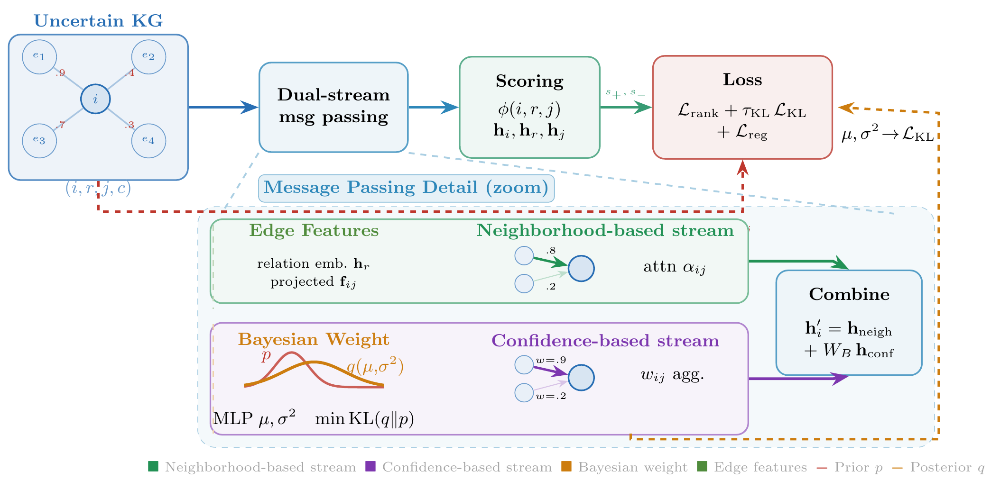

# DS-GAT



DS-GAT is a dual-stream graph attention network for uncertain knowledge graph embedding. It is evaluated against two groups of baselines:

- **unKR baselines** (BEUrRE, FocusE, PASSLEAF, UPGAT, ssCDL): run via wrapper scripts in `baselinesu/` using the local `unKR/` library, on CN15k, NL27k, and PPI5k.
- **GAT baselines** (EGAT, WSGAT, GATv2): re-implemented graph attention models trained under the same conditions as DS-GAT, providing a direct comparison on identical data splits and evaluation protocol.

All experiments are run on three uncertain knowledge graph datasets: **CN15k**, **NL27k**, and **PPI5k**.

---

## Setup

```bash
# 1. PyTorch with CUDA (example: CUDA 11.8)
pip install torch torchvision --index-url https://download.pytorch.org/whl/cu118

# 2. PyTorch Geometric
pip install torch-geometric

# 3. torch-scatter (must match torch + CUDA version)
TORCH_VER=$(python -c "import torch; print(torch.__version__)")
pip install torch-scatter -f "https://data.pyg.org/whl/torch-${TORCH_VER}+cu118.html"

# 4. Install the unKR library (required for unKR baselines)
pip install -e unKR/

# 5. Remaining dependencies
pip install -r requirements.txt
```

---

## Running DS-GAT

The recommended way to run experiments is via a YAML config file. All configs are in `config/`.

### Main model (DSGAT2)

```bash
python models.py --config config/DSGAT2_cn15k.yaml
python models.py --config config/DSGAT2_nl27k.yaml
python models.py --config config/DSGAT2_ppi5k.yaml
```

Any config value can be overridden on the command line — CLI arguments always take precedence over the YAML file:

```bash
python models.py --config config/DSGAT2_cn15k.yaml --gpu 1 --seed 42
```

### Ablation models (DSGATA1, DSGATA2)

```bash
python models.py --config config/ablation/DSGATA1_cn15k.yaml
python models.py --config config/ablation/DSGATA2_nl27k.yaml
```

### GAT baseline models (EGAT, WSGAT, GATV2)

Config files are in `config/GAT/`:

```bash
python models.py --config config/GAT/EGAT_cn15k.yaml
python models.py --config config/GAT/WSGAT_nl27k.yaml
python models.py --config config/GAT/GATV2_ppi5k.yaml
```

### Multiple seeds (reproducibility)

All paper results use seeds `42, 2602, 4510, 6635, 9394`. Run each seed independently:

```bash
for SEED in 42 2602 4510 6635 9394; do
    python models.py --config config/DSGAT2_cn15k.yaml --seed $SEED
done
```

On a SLURM cluster, submit one job per seed with `--gres=gpu:1` and the appropriate `--seed` flag.

---

## Running unKR baselines

The unKR baselines (BEUrRE, FocusE, PASSLEAF, UPGAT, ssCDL) use wrapper scripts in `baselinesu/` with YAML configs in `baselinesu/config/{dataset}/`.

### Single run

```bash
python baselinesu/BEUrREdemo.py   --config baselinesu/config/cn15k/BEUrRE_cn15k.yaml   --dataset cn15k --seed 42
python baselinesu/FocusEdemo.py   --config baselinesu/config/cn15k/FocusE_cn15k.yaml   --dataset cn15k --seed 42
python baselinesu/PASSLEAFdemo.py --config baselinesu/config/cn15k/PASSLEAF_cn15k.yaml --dataset cn15k --seed 42
python baselinesu/UPGATdemo.py    --config baselinesu/config/cn15k/UPGAT_cn15k.yaml    --dataset cn15k --seed 42
python baselinesu/ssCDLdemo.py    --config baselinesu/config/cn15k/ssCDL_cn15k.yaml    --dataset cn15k --seed 42
```

Replace `cn15k` with `nl27k` or `ppi5k` and update `--dataset` accordingly.

### Multiple seeds (reproducibility)

Same approach as DS-GAT — run each seed independently:

```bash
for SEED in 42 2602 4510 6635 9394; do
    python baselinesu/BEUrREdemo.py --config baselinesu/config/cn15k/BEUrRE_cn15k.yaml \
        --dataset cn15k --seed $SEED
done
```

UPGAT was evaluated with 3 seeds (42, 6635, 9394) due to longer training time.

---

## Config files

```
config/
├── DSGAT2_cn15k.yaml          # Main model — CN15k
├── DSGAT2_nl27k.yaml          # Main model — NL27k
├── DSGAT2_ppi5k.yaml          # Main model — PPI5k
├── ablation/
│   ├── DSGATA1_cn15k.yaml     # Ablation A1 (attention-only)
│   ├── DSGATA1_nl27k.yaml
│   ├── DSGATA1_ppi5k.yaml
│   ├── DSGATA2_cn15k.yaml     # Ablation A2 (no Bayesian stream)
│   ├── DSGATA2_nl27k.yaml
│   └── DSGATA2_ppi5k.yaml
└── GAT/
    ├── EGAT_cn15k.yaml        # GAT baselines
    ├── EGAT_nl27k.yaml
    ├── EGAT_ppi5k.yaml
    ├── WSGAT_cn15k.yaml
    ├── WSGAT_nl27k.yaml
    ├── WSGAT_ppi5k.yaml
    ├── GATV2_cn15k.yaml
    ├── GATV2_nl27k.yaml
    └── GATV2_ppi5k.yaml

baselinesu/config/
├── cn15k/
│   ├── BEUrRE_cn15k.yaml
│   ├── FocusE_cn15k.yaml
│   ├── PASSLEAF_cn15k.yaml
│   ├── UPGAT_cn15k.yaml
│   └── ssCDL_cn15k.yaml
├── nl27k/   (same structure)
└── ppi5k/   (same structure)
```

---

## Output

Running any model creates an `output/` directory (excluded from git):

| File | Contents |
|---|---|
| `output/{model}_{score}_{dataset}_s{seed}t_best_mrr_model.pth` | Best checkpoint per seed |
| `output/metrics_{model}_{score}_{dataset}_s{seed}_{timestamp}.csv` | Test metrics (MRR, Hits@K, MAE) |

Pre-computed results for all models and seeds are in `results/`:

```
results/
├── baselines/     # Per-seed metrics CSVs for all baselines and DS-GAT
├── ablation/      # Ablation study metrics
└── bayesian_analysis/  # Robustness analysis plots
```

---

## Analysis scripts

```bash
python aggregate_results.py      # Aggregate per-seed CSVs into mean ± std tables
python statistical_tests.py      # Wilcoxon / Friedman significance tests
python banalisisb_multi.py       # Bayesian robustness analysis (multi-dataset)
python compute_timing_table.py   # Training time comparison table
```
